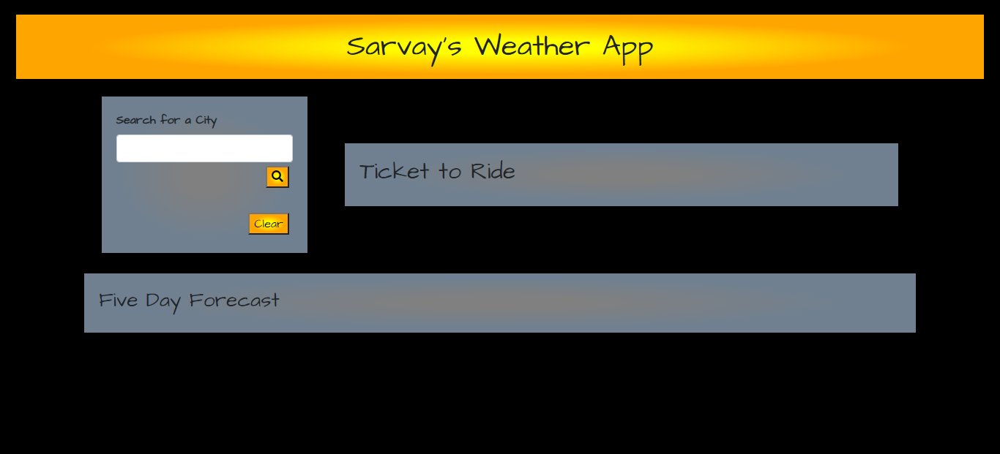
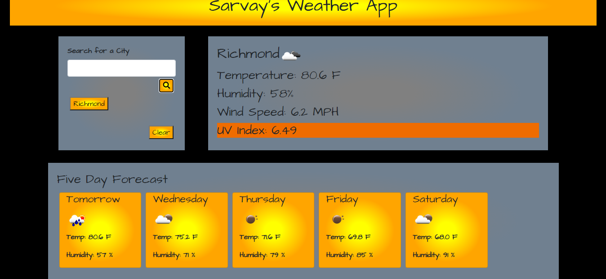
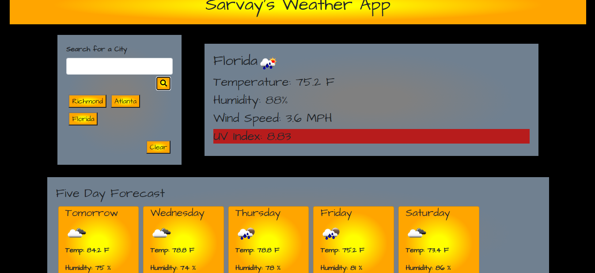
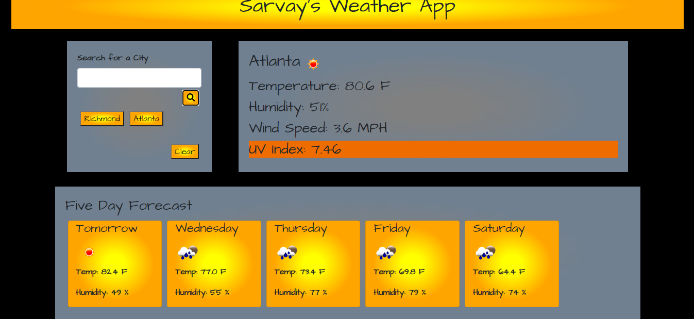

# Sarvay's Weather App
created by Jordan Sarvay

The purpose of this app is to pull on the openweathermaps API to allow someone to retrieve the daily weather forecast as well as the five day forecas.
In order to help planning a trip, recent searches are stored as buttons to make returning to previously search cities easy.

With this app:
- Easy to read icons about the current weather are rendered to the user.

- UV index readings are color coded with standard coloring based on safety.

- Recently searched cities are stored to local storage and populated as buttons.

- The previously searched city's information will populate the screen upon reload.

- The clear button allows previous searches to be cleared from local storage and the screen.

If you have any questions or concerns with the use of this app, please contact Jordan Sarvay at jordans1@vt.edu or at 804-305-4878.

Deployed URL: https://jsarvay.github.io/weather-app/

